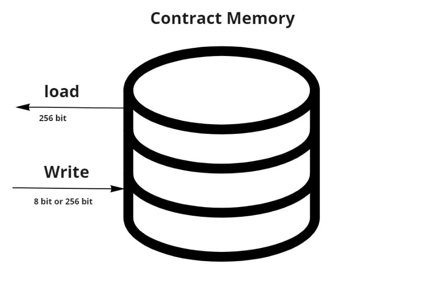

# Memory position at Smart Connects 

contract **memory** is a place to store the **bytes**, its simple byte array, where data can be stored in 32 bytes(256 bit) or 1 byte(8 bit) segment and loaded in 32 bytes (256 bit) segment, the image in below is shown as well the memory structure with reading and writing part of contract memory.

this operation is determined by **3 opcodes** that process on memory.

- MSTORE (x, y) - Store a 32 byte (256-bit) value “y” starting at memory location “x”

- MLOAD (x) - Load 32 bytes (256-bit) starting at memory location “x” onto the call stack

- MSTORE8 (x, y) - Store a 1 byte (8-bit) value “y” at memory location “x” (the least significant byte of the 32-byte stack value).

y is value and x is location, where value is stored in.

> note: x comes from the array index of where to start writing/reading the data. 

# what happens when your contract is written in memory 

 you should pay for the number of bytes written! 

> note: if you are writing to a new part of memory that hasn't been written before it takes more cost, for using the first time of this area of memory.

# Free Memory Pointer

free memory pinter shows us where the area of memory is free. (where free memory starts)

> note: free memory pointer protects contract to not overwriting on the area that is held by another variable.

# what happens when the variable is written 

in the first step variable reference to the free memory pointer to Select the where data should be stored.

